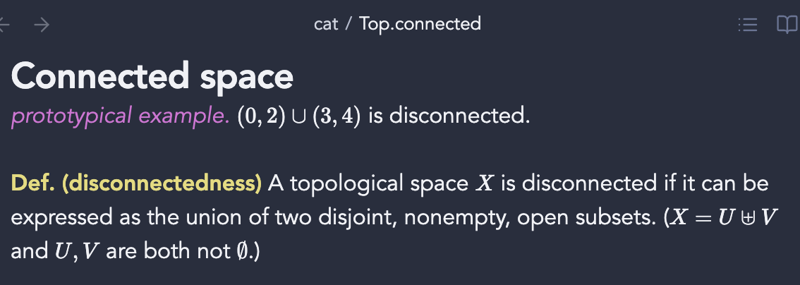
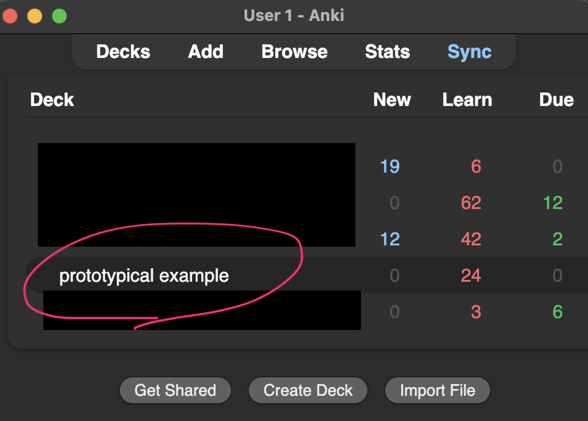
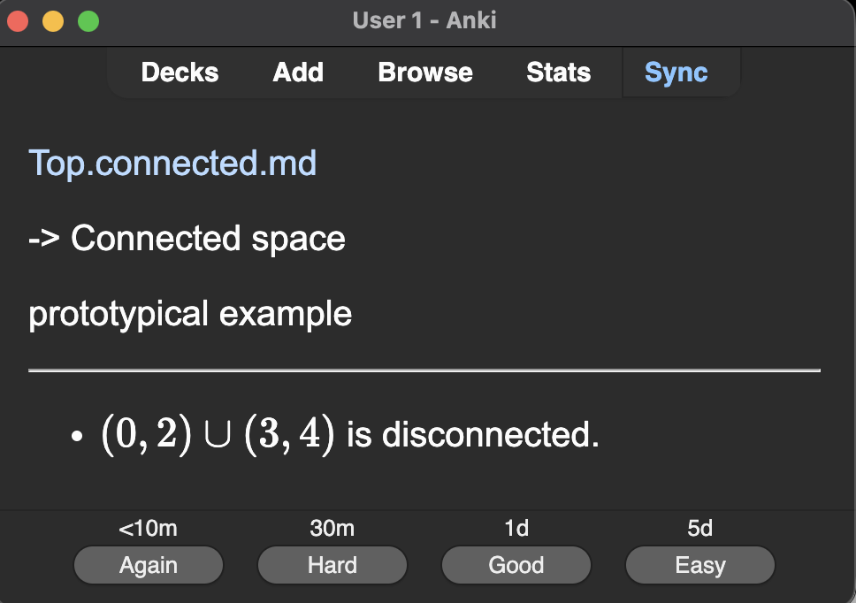

# Anki Trigger Flashcards for Obsidian

An Obsidian plugin that generates Anki flashcards from trigger words in your notes. Transform your structured notes into effective spaced repetition study material by identifying definitions, examples, formulas, and key concepts.

## ✨ Features

- **🎯 Trigger Processing**: Convert trigger words (definitions, examples, formulas) into flashcards
- **🚀 Direct Anki Export**: Send cards directly to Anki using AnkiConnect
- **📂 Batch Processing**: Process multiple folders at once
- **⚡ Fast Processing**: Local processing for immediate results

## 📝 Quick Usage

### 🎯 Trigger Processing

The plugin focuses on triggers that help structure your learning material. Front of anki note will be triggers and Back of note will be the remaining line after triggers. Simply add trigger words in the settings.

**Example triggers:**
- `prototypical example:` - Create example cards  
- `key point:` - Create key point cards

**Usage example:**

In markdown notes, begin lines with trigger words followed by your content. (Applying bold or italics to triggers are allowed)

Run the "Export All Files Directly to Anki" command. Open the Anki app to see your new cards.

For each trigger, the deck is created automatically in Anki.

## 🚀 Getting Started

### 1. Installation

1. Download the latest release from the [Releases page](../../releases)
2. Extract the files to your Obsidian vault's `.obsidian/plugins/anki-trigger-flashcards/` folder
3. Enable the plugin in Obsidian Settings > Community Plugins

### 2. Configure the Plugin

1. Go to Settings > Community Plugins > Anki Trigger Flashcards
2. Paste your Gemini API key (optional)
3. Configure triggers and folder paths as needed

## 🎯 Commands

### Primary Functions
- **Generate Cards from Triggers** - Main functionality that creates cards from trigger words
- **Process Multiple Folders for Triggers** - Batch process multiple folders for trigger words
- **Export All Files Directly to Anki** - Generate cards directly to Anki via AnkiConnect

### Testing & Diagnostics  
- **Test AnkiConnect Connection** - Verify AnkiConnect setup and show available decks
- **Test Gemini API Connection** - Verify your Gemini API key is working
- **List Available Folders** - Show all folders in your vault for configuration

## ⚙️ Configuration

Configure triggers and folder paths in the plugin settings:

1. **Triggers**: Add/modify the list of triggers to recognize
2. **Folder Paths**: Set specific folders to process when using batch operations  
3. **AnkiConnect**: Enable direct export to Anki and configure connection settings

### 🔗 AnkiConnect Setup

For direct export to Anki:

1. **Install AnkiConnect**: In Anki, go to Tools → Add-ons → Get Add-ons → Code: `2055492159`
2. **Restart Anki**: Close and reopen Anki after installation
3. **Enable in Plugin**: Go to plugin settings and enable AnkiConnect
4. **Test Connection**: Use "Test AnkiConnect Connection" command to verify setup

## 🤝 Contributing

1. Fork the repository
2. Create a feature branch (`git checkout -b feature/amazing-feature`)
3. Commit your changes (`git commit -m 'Add amazing feature'`)
4. Push to the branch (`git push origin feature/amazing-feature`)
5. Open a Pull Request

## 🙏 Acknowledgments

- Built with [Obsidian Plugin API](https://docs.obsidian.md/Plugins/Getting+started/Build+a+plugin)
- Thanks to the Obsidian community